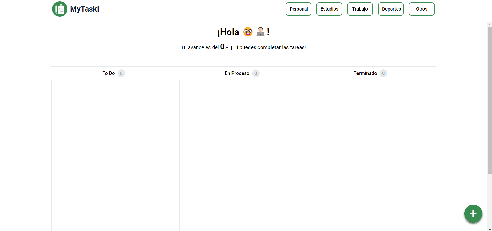

# MyTaski 📊 | Project Task Manager App 

- [Interface App - Modelo](https://bordio.com/wp-content/themes/understrap/images/homepage/kanban-xl-1x.webp)
- [Canvas del modelo base de la app, primer Story Map y Metodología MoSCoW](https://excalidraw.com/#json=a_o5pxBZEDW17JiO49taR,-Xh19twN19IR8KPno0Z50Q)
- [Primer mockup de la app, adaptado para desktop y mobile](https://design.penpot.app/#/view/a05161ef-ac42-80c0-8004-e2646cfb9150?page-id=a05161ef-ac42-80c0-8004-e2646cfb9151&section=interactions&index=0&share-id=a05161ef-ac42-80c0-8004-e2658f014fbc)
- [SCRUM del proyecto en Jira](https://sebasurdanegui.atlassian.net/jira/software/projects/SCRUM/boards/1/backlog?selectedIssue=SCRUM-3&atlOrigin=eyJpIjoiNWI1OGMwZDk1NjNmNDczYzgyNGJiODY1MmY1NjIyNjgiLCJwIjoiaiJ9)

## **Home**

## **Home - Add Task**
If you want to add a task, you can click on the green button (at the bottom right of the screen), and this action will open a modal where you can enter your data. For instance, the title (text), description (text), due date (select date), and task category (select box).

## **Home - View Tasks**
You can view all tasks by status (To Do, In Process, and Done) on the main screen of the application with the data you entered earlier.

## **Home - Update Tasks**
Oh no! Maybe you entered incorrect information when creating a task. Don't worry! 🔥 You have the option to update the data. Simply click on the card, and this will open a modal for updating it.

## **Home - Filter Task**

In addition, you have a feature to filter tasks and only see tasks that belong to a specific category (personal, studies, work, sports, and others). You can apply one or more filters at the same time, but remember, if you want to see all tasks, you must remove the filters.

## **Home Responsive**

Also, our application is designed to be responsive (mobile first). Therefore, a breakpoint was added for screens with a width of less than 920px, transforming the grid section into a Tab Top Navigation. Amazing! 🚀

Thanks for your time! See you later, and take advantage of this application to organize your life! 👋🏻💯

> Designed and developed by Sebastian Marat Urdanegui Bisalaya
> Create template and code verification Max Antony